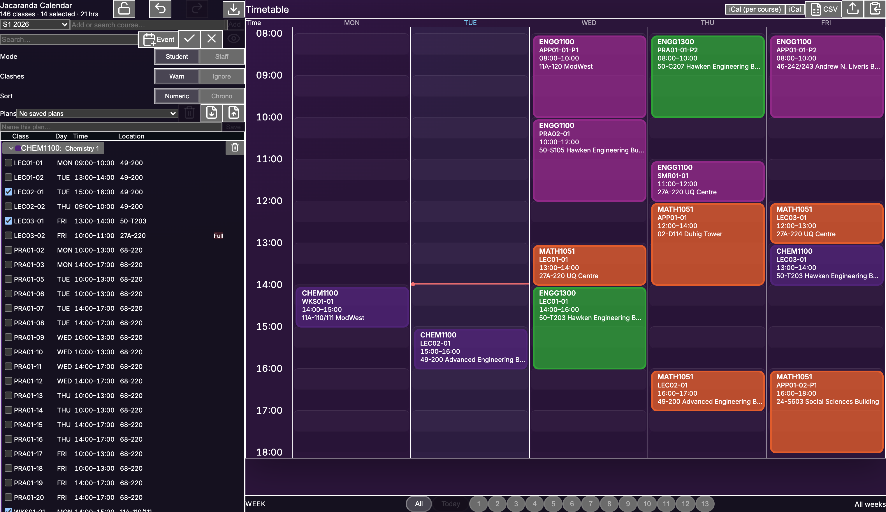

<div align="center">


[](https://github.com/miggyval/jacaranda-calendar/releases/latest)
[](https://github.com/miggyval/jacaranda-calendar/releases)
[](LICENSE)

[](https://tauri.app)

</div>

A fast desktop timetable planner for University of Queensland students and staff. Add courses by
code, arrange your classes visually, avoid clashes, and export the result to your real calendar.

> **Not affiliated with, endorsed by, or an official product of The University of Queensland.**
> Jacaranda Calendar reads UQ's **public** class timetable (the same data as the public Allocate+
> site) and is an independent, unofficial tool. "UQ" and related marks belong to the University.



*Example: a Semester 1 first-year engineering load (ENGG1100, MATH1051, ENGG1300, CHEM1100).*

## Features

- **Add courses by code** — pulls the live timetable straight from UQ (no CSV hand-building).
- **Student & Staff modes** — one stream per activity group, or free multi-select for teaching staff.
- **Clash detection** — warns on overlaps; ignore per-class or globally.
- **Week-aware** — filter to a single teaching week; jump to today with a live "now" line.
- **Custom events** — add your own meetings, consultations, or activities (weekly or one-off).
- **Drag to swap** streams, **undo/redo**, **lock mode**, colour-coded courses, collapsible groups.
- **Export** — week-accurate iCal (per course or combined), CSV, and a PNG of your timetable; save,
  export, and share plans as portable `.uqplan` files.

## Install

Grab the latest build from the [Releases page](../../releases/latest):

- **Windows** — `..._x64-setup.exe` (or the `.msi`). If SmartScreen appears: **More info → Run anyway**.
- **macOS** — Apple Silicon: the `aarch64` `.dmg`; Intel: the `x64` `.dmg`. Drag to Applications; on
  first launch macOS says it can't verify the app — click **Done**, then **System Settings → Privacy &
  Security → Open Anyway**. (The apps are ad-hoc signed but not notarized.)
- **Linux** — `.AppImage` (`chmod +x` then run), `.deb`, or `.rpm`; `amd64` or `aarch64`.

## Development

Built with Tauri 2 (Rust) + React 19 + TypeScript + Vite.

```bash
npm install
npm run dev          # web dev server
npm run tauri dev    # full desktop app
npm run tauri build  # build installers for the current platform
```

## AI-assisted development

This project was built with substantial help from generative AI — Anthropic's Claude, via Claude
Code. AI was used throughout: writing and refactoring features, debugging, setting up the CI/release
pipeline, and documentation. All work was directed, reviewed, and tested by the author, who takes
responsibility for the result. Individual commits are annotated with `Co-Authored-By` trailers where
AI contributed.

## License

[GPL-3.0-only](LICENSE) © Miguel Marco Valencia
